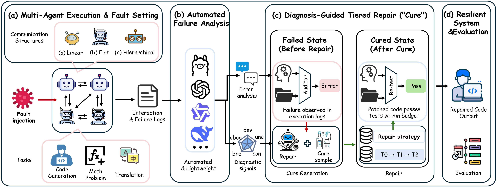
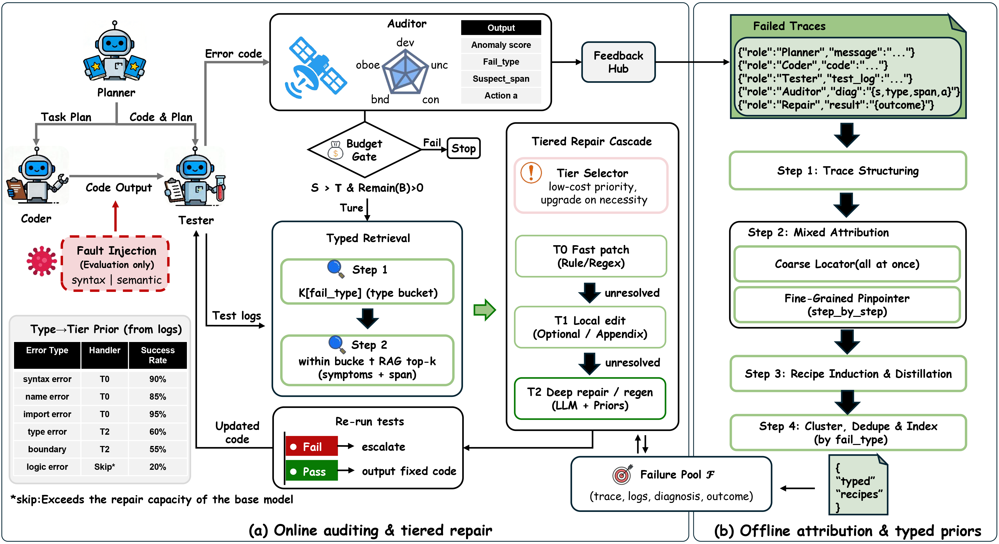
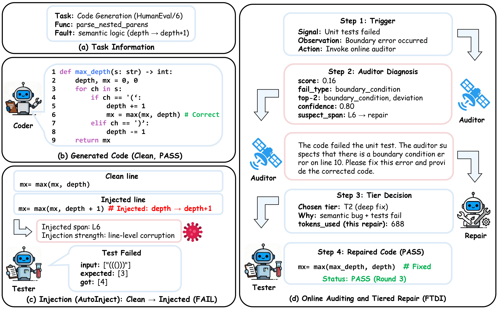

<p align="center">
  <h2 align="center">
  FTDI: A Budget-Aware Self-Healing Framework for Resilient LLM Multi-Agent Code Generation
  </h2>
  <p align="center">
    <a><strong>Sixue Men</strong></a><sup>1</sup>
    ·
    <a><strong>Qinyue Tong</strong></a><sup>1</sup>
    ·
    <a><strong>Rui Zuo</strong></a><sup>1</sup>
    ·
    <a><strong>Zheming Lu</strong></a><sup>1*</sup>
    <br>
    <sup>1</sup>School of Aeronautics and Astronautics, Zhejiang University, Hangzhou 310027, Zhejiang, China
    <br>
    <sup>*</sup>Corresponding author: zheminglu@zju.edu.cn
    <br>
    <br>
    <div align="center">
      <a href='https://github.com/UMENZZE/FTDI-Framework'></a>
      <a href='#'></a>
      
    </div>
  </p>
</p>

<p align="center">
  
</p>

---

## :mega: News

- **2026.03**: We released the FTDI codebase and sample experiment results.

---

## :memo: ToDo List

- [ ] Release full experiment result data.
- [x] Release FTDI framework source code.
- [x] Release sample results on HumanEval, HumanEval+, and MBPP.

---

## Overview

**FTDI** is a budget-aware self-healing framework for LLM-based multi-agent code generation. When faults corrupt the Coder output in a Planner→Coder→Tester pipeline—whether caused by semantic perturbations, runtime errors, or structural injections—FTDI intercepts, diagnoses, and repairs compromised outputs through a tiered repair strategy, spending budget only where diagnostic evidence justifies it.


<p align="center">
  
</p>

The figure below shows a concrete example of a clean code message, its injected (attacked) version, and the repaired output produced by FTDI:

<p align="center">
  
</p>

### Key Components

| Component | File | Description |
|-----------|------|-------------|
| **AutoInject** | `fault_injection/auto_inject.py` | Parameterized fault injector — injects syntax/semantic/text faults at message level ($P_m$) and line level ($P_e$); produces a deterministic **manifest** (seed + line spans + diff) for reproducible replay |
| **Auditor** | `ftdi/auditor.py` | Zero-overhead static scorer — five diagnostic dimensions: Deviation ($w$=0.35), Consistency ($w$=0.25), Uncertainty ($w$=0.20), Boundary ($w$=0.20), Off-by-one ($w$=0.20); outputs anomaly score $s$, `fail_type`, `suspect_span` |
| **Hook** | `ftdi/hook.py` | Environment-level interceptor — instruments `publish_message` to trigger Auditor and budget gate, then dispatches to tiered repair |
| **Tiered Repair** | `ftdi/tiered_repair.py` | Cost-benefit tier dispatcher (Algorithm 1): T0 regex fast-patch → T1 constrained local edit → T2 deep regeneration; stops early when budget is exhausted |
| **Repair Strategy** | `ftdi/repair_strategy.py` | `fail_type` → repair tier mapping; |
| **Repair Agent** | `ftdi/repair_agent.py` | LLM-powered repair engine; retrieves typed repair priors from the knowledge base as prompting evidence |
| **Knowledge Base** | `knowledge_base/` | `distilled_cures.json` — failure-type-indexed repair priors distilled from historical trajectories; `cure_library.json` — generic fallback |
| **Defense Baselines** | `ftdi/defense_baseline.py` | Challenger & Inspector baselines (Huang et al., 2024) |

### Fault Injection Model

Injection is controlled by two probabilities:
- **$P_m$** — probability that a given message is selected for injection
- **$P_e$** — probability that a selected line within that message is mutated
- **`max_lines`** — cap on the number of modified lines per message

Error types: `syntax`, `semantic`, `text`, `translate`

Each run writes a **manifest** (`seed` + `corrupted_spans` + `code_diff`) so the exact same faults can be replayed across all compared methods for fair evaluation. Pre-generated manifests for the paper's main experiments are in `fault_injection/manifests/`.

### Evaluation Metrics

| Metric | Description |
|--------|-------------|
| **Pass@1** | Functional correctness on hidden test suite |
| **Resilience** | $S_\text{FTDI} / S_\text{clean} \times 100\%$ |
| **RecoveryRatio** | $(S_\text{FTDI} - S_\text{faulty}) / (S_\text{clean} - S_\text{faulty}) \times 100\%$; can exceed 100% when FTDI surpasses the clean baseline |
| **Tok./1%Rec.** | Average tokens per 1 percentage-point of recovery — lower is better |

---

## Getting Started

### Requirements

```bash
# Clone the repository
git clone https://github.com/UMENZZE/FTDI-Framework.git
cd FTDI-Framework

# Create and activate environment
conda env create -f llmfix_conda.yml
conda activate autoagent
```

### API Configuration

Create a `.env.inference` file in the project root:

```bash
OPENAI_API_BASE=https://your-api-endpoint/v1
OPENAI_API_KEY=your-key
OPENAI_API_MODEL=qwen2.5-32b-instruct

# Repair agent (can use a separate stronger model)
REPAIR_BASE_URL=https://your-api-endpoint/v1
REPAIR_API_KEY=your-repair-key
REPAIR_MODEL=deepseek-v3
```

---

## Running Experiments

### Healthy Baseline (no attack)

```bash
bash scripts/run_healthy.sh
```

### Attack Only (no repair)

```bash
PM=0.8 PE=0.3 bash scripts/run_attack.sh
```

### FTDI Full Defense (attack + tiered repair)

```bash
PM=0.775 PE=0.3 bash scripts/run_ftdi.sh
```

### Key Parameters

| Variable | Default | Description |
|----------|---------|-------------|
| `PM` | `0.8` | Message-level injection probability $P_m$ |
| `PE` | `0.3` | Line-level injection probability $P_e$ |
| `MAX_LINES` | `1` | Max lines mutated per message |
| `MAX_ROUNDS` | `12` | Max interaction rounds per task (`1` for Linear topology) |
| `TOKEN_BUDGET` | `10000` | Token budget per task $T_\text{max}$ |
| `AUDITOR_THRESHOLD` | `0.7` | Trigger threshold $\tau$ |
| `REPAIR_ENABLED` | `on` | Enable/disable FTDI repair |
| `REPAIR_TRIGGERS` | `T0,T2` | Which repair tiers to activate |
| `AUDITOR_ENABLED` | `on` | Ablation: disable Auditor (`w/o Auditor`) |
| `REPAIR_KB_MODE` | `distilled` | Ablation: `distilled` (full) / `attribution` (w/o Typed Repair KB) / `typed` (w/o Attribution KB) / `none` (no KB) |
| `TOPOLOGY` | `hierarchical` | Agent graph: `hierarchical` / `flat` / `linear` |
| `CONC` | `6` | Concurrent evaluation workers |

---

## Main Results

Under semantic fault injection ($P_m=0.8$, $P_e=0.3$, `max_lines=1`), FTDI achieves:

| Benchmark | Pass@1 (Clean) | Pass@1 (Faulty) | Pass@1 (FTDI) | Resilience | RecoveryRatio | Tok./1%Rec. |
|-----------|---------------|-----------------|---------------|------------|---------------|-------------|
| HumanEval | 64.02% | 50.00% | **63.41%** | **99.05%** | **95.65%** | **41.5** |
| HumanEval+ | 54.88% | 37.80% | **53.05%** | **96.67%** | **89.29%** | **83.9** |
| MBPP | 44.96% | 33.02% | **46.84%** | **104.18%** | **115.75%** | **51.6** |

RecoveryRatio > 100% on MBPP indicates that FTDI's T2 deep repair fixes pre-existing weaknesses beyond the injected fault.

---

## Sample Results

Representative experiment outputs are provided in [`sample_results/`](sample_results/). Each directory contains per-task `results.jsonl`, generated `samples.jsonl`, and token event logs.

| Directory | Condition | Benchmark | PM | PE |
|-----------|-----------|-----------|-----|-----|
| `humaneval_healthy` | Healthy baseline | HumanEval | 0 | 0 |
| `humaneval_attack` | Attack only | HumanEval | 0.8 | 0.3 |
| `humaneval_ftdi` | FTDI repair | HumanEval | 0.8 | 0.3 |
| `humaneval_plus_healthy` | Healthy baseline | HumanEval+ | 0 | 0 |
| `humaneval_plus_attack` | Attack only | HumanEval+ | 0.8 | 0.3 |
| `humaneval_plus_ftdi` | FTDI repair | HumanEval+ | 0.8 | 0.3 |
| `mbpp_healthy` | Healthy baseline | MBPP | 0 | 0 |
| `mbpp_attack` | Attack only | MBPP | 0.8 | 0.3 |
| `mbpp_ftdi` | FTDI repair | MBPP | 0.8 | 0.3 |

---

## Project Structure

```
FTDI/
├── fault_injection/
│   └── auto_inject.py          # Controlled fault injector
├── ftdi/
│   ├── auditor.py              # Online deviation scorer
│   ├── hook.py                 # Environment-level interceptor
│   ├── tiered_repair.py        # T0/T1/T2 tiered repair dispatcher
│   ├── repair_agent.py         # LLM-powered repair engine
│   ├── repair_strategy.py      # Error type → repair strategy mapping
│   └── defense_baseline.py     # Challenger & Inspector baselines
├── knowledge_base/
│   ├── cure_library.json       # Generic cure library
│   └── distilled_cures.json    # Distilled cure library (AutoInject patterns)
├── evaluation/
│   └── humaneval_eval.py       # HumanEval/HumanEval+/MBPP evaluation runner
├── scripts/
│   ├── run_healthy.sh          # Healthy baseline experiment
│   ├── run_attack.sh           # Attack-only experiment
│   └── run_ftdi.sh             # FTDI full defense experiment
├── sample_results/             # Representative experiment outputs
└── images/                     # README figures (PNG)
    ├── Introduction.png
    ├── FTDI_Framework_Overview.png
    └── Clean_Injected_Repaired.png
```

---

## :clap: Acknowledgements

The MAS backbone in this project is built upon [AutoAgents](https://github.com/Link-AGI/AutoAgents).  We appreciate their valuable contributions.

---

